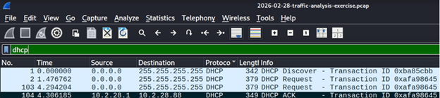
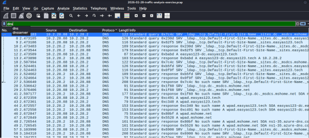
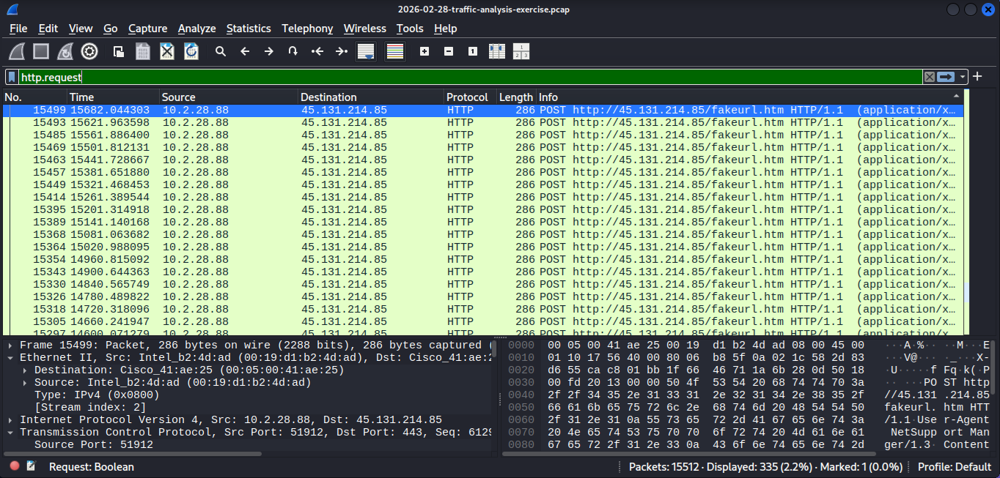
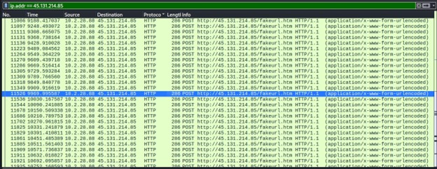
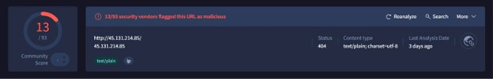

# Wireshark Traffic Analysis Lab
**Malicious PCAP Analysis | IOC Extraction | Threat Brief**

> Hands-on network forensics lab using Wireshark to identify malicious activity, extract Indicators of Compromise (IOCs), and produce a structured threat brief — simulating the workflow of a SOC Tier-1 analyst.

---

## Lab Environment

| Component | Details |
|---|---|
| **Analysis Tool** | Wireshark 4.x |
| **PCAP Source** | [malware-traffic-analysis.net](https://www.malware-traffic-analysis.net/training-exercises.html) — 2026-02-28 exercise |
| **Platform** | Kali Linux (isolated VM) |
| **Network** | Host-only — no live malicious traffic |

> ⚠️ All analysis performed against a locally stored PCAP file. No live malicious systems were contacted.

---

## Objectives

- Load and navigate a real-world malicious PCAP in Wireshark
- Identify the infected host via DHCP and ARP analysis
- Isolate C2 traffic using targeted display filters
- Follow HTTP streams to extract malware behaviour
- Produce an IOC table and threat brief mapped to MITRE ATT&CK

---

## Analysis Summary

| Field | Value |
|---|---|
| **PCAP File** | 2026-02-28-traffic-analysis-exercise.pcap |
| **Infected Host IP** | 10.2.28.88 |
| **Infected Host MAC** | 00:19:d1:b2:4d:ad (Intel NIC) |
| **Infected Host OS** | Windows NT (from server response header) |
| **Malware Family** | NetSupport RAT |
| **C2 IP** | 45.131.214.85 |
| **C2 URL** | http://45.131.214.85/fakeurl.htm |
| **VirusTotal Detections** | 13/93 vendors flagged as malicious |
| **C2 Behaviour** | Periodic HTTP POST beaconing every ~60 seconds |

---

## Step 1 — Identify the Infected Host (DHCP)

Filter: `bootp` or `dhcp`

The DHCP ACK packet reveals the infected host was assigned IP `10.2.28.88` by the local DHCP server at `10.2.28.1`. MAC address `00:19:d1:b2:4d:ad` confirms an Intel NIC.



---

## Step 2 — Inspect DNS Queries

Filter: `dns`

DNS queries show which domains the infected host attempted to resolve before and after infection. Absence of DNS lookups before direct-IP C2 connections is itself a red flag.



---

## Step 3 — Isolate HTTP Requests

Filter: `http.request`

All outbound HTTP requests from the infected host are listed. The repeated POST requests to `45.131.214.85/fakeurl.htm` stand out immediately — a legitimate host would not repeatedly POST to a raw external IP.



---

## Step 4 — Filter by C2 IP

Filter: `ip.addr == 45.131.214.85`

Isolating all traffic to and from the C2 IP confirms the beaconing pattern — repeated POST requests every ~60 seconds, consistent with NetSupport RAT's polling behaviour.



---

## Step 5 — Follow HTTP Stream (User-Agent & Commands)

Right-click any HTTP packet → **Follow > HTTP Stream**

The stream reveals the hardcoded NetSupport RAT `User-Agent` string and the C2 command protocol (`CMD=POLL`, `CMD=ENCD`, `DATA=`). This confirms malware family and active C2 communication.


---

## Step 6 — VirusTotal Verification

The C2 IP `45.131.214.85` was checked on [VirusTotal](https://www.virustotal.com) — **13 out of 93 vendors** flagged it as malicious, confirming the C2 is a known threat infrastructure.



---

## Attack Timeline

| Time (Relative) | Event |
|---|---|
| 0.000000s | DHCP Discover — infected host requests IP |
| 4.306185s | DHCP ACK — host assigned 10.2.28.88 |
| ~9188s | First HTTP POST to 45.131.214.85/fakeurl.htm |
| ~9188s+ | C2 beaconing begins — POST every ~60 seconds |
| Ongoing | Encoded data (`CMD=ENCD`, `DATA=...`) sent to infected host |

---

## Indicators of Compromise (IOCs)

| Type | Value | Notes |
|---|---|---|
| **C2 IP** | 45.131.214.85 | 13/93 vendors flagged on VirusTotal |
| **C2 URL** | http://45.131.214.85/fakeurl.htm | NetSupport RAT callback URL |
| **User-Agent** | `NetSupport Manager/1.3` | Hardcoded RAT user-agent string |
| **C2 Commands** | `CMD=POLL`, `CMD=ENCD` | Polling and encoded command protocol |
| **Server Header** | `NetSupport Gateway/1.92 (Windows NT)` | Attacker C2 server fingerprint |
| **Infected Host IP** | 10.2.28.88 | Internal host performing all C2 callbacks |
| **Infected Host MAC** | 00:19:d1:b2:4d:ad | Intel NIC — from Ethernet frame headers |

---

## Wireshark Filters Used

```wireshark
# DHCP — identify infected host
bootp

# DNS lookups
dns

# All HTTP requests
http.request

# Isolate C2 traffic
ip.addr == 45.131.214.85

# SYN scan detection
tcp.flags.syn == 1 && tcp.flags.ack == 0
```

---

## What NetSupport RAT Does

NetSupport RAT is a legitimate remote administration tool (NetSupport Manager) abused by threat actors. Once installed it:

- **Beacons** to the C2 server over HTTP POST at regular intervals (`CMD=POLL`)
- **Receives encoded commands** from the attacker (`CMD=ENCD` + `DATA=` field)
- **Provides full remote control** — keylogging, screen capture, file transfer, command execution
- **Blends in** using a legitimate tool's User-Agent and standard HTTP traffic, evading shallow inspection

---

## MITRE ATT&CK Mapping

| Tactic | Technique | ID |
|---|---|---|
| Initial Access | Phishing / Drive-by Compromise | T1566 / T1189 |
| Execution | User Execution: Malicious File | T1204.002 |
| Persistence | Remote Access Software | T1219 |
| Command & Control | Application Layer Protocol: Web Protocols | T1071.001 |
| Command & Control | Non-Standard Port (HTTP to external IP) | T1571 |
| Exfiltration | Exfiltration Over C2 Channel | T1041 |

---

## Defender Takeaways

### SOC Detection Signals
| Signal | Detection Logic |
|---|---|
| **Unusual User-Agent** | `NetSupport Manager/1.3` is never browser traffic — alert on this string |
| **Beaconing pattern** | Same external IP hit via POST every ~60s — SIEM rule: >10 POSTs/hour to same external IP |
| **`/fakeurl.htm` path** | No legitimate site uses this path — alert on HTTP requests containing `fakeurl` |
| **Direct-IP HTTP** | Host connected to raw IP, no prior DNS — flag all direct-IP outbound HTTP |
| **`CMD=POLL` in POST body** | Content inspection rule in web proxy or IDS/IPS |

### Preventive Controls
| Control | How It Helps |
|---|---|
| **Web Proxy + SSL Inspection** | Intercepts traffic, blocks unknown external IPs, inspects POST bodies |
| **EDR** | Detects NetSupport Manager running outside approved software list |
| **Application Whitelisting** | Blocks unauthorized executables — NetSupport not on approved list = blocked |
| **Egress Filtering** | Block outbound HTTP to raw IPs — eliminates this entire C2 channel |
| **SIEM Correlation Rule** | `User-Agent contains NetSupport` OR `POST to external IP > 10/hour` → P1 alert |

---

## Academic & Professional Context

- **CompTIA Security+ SY0-701** — Domain 4.9: Use data sources to support an investigation
- **NIST SP 800-61** — Incident Response Phase 2: Detection & Analysis
- **SOC Tier-1 duties** — Alert triage, PCAP review, IOC extraction, threat brief production

---

## Status

- [x] Lab environment configured
- [x] PCAP downloaded and analysed
- [x] Infected host identified (10.2.28.88)
- [x] C2 traffic isolated and confirmed (45.131.214.85)
- [x] HTTP stream followed — NetSupport RAT confirmed
- [x] IOCs extracted and documented
- [x] VirusTotal verification completed (13/93)
- [x] MITRE ATT&CK mapping finalised
- [x] Screenshots embedded inline in README
